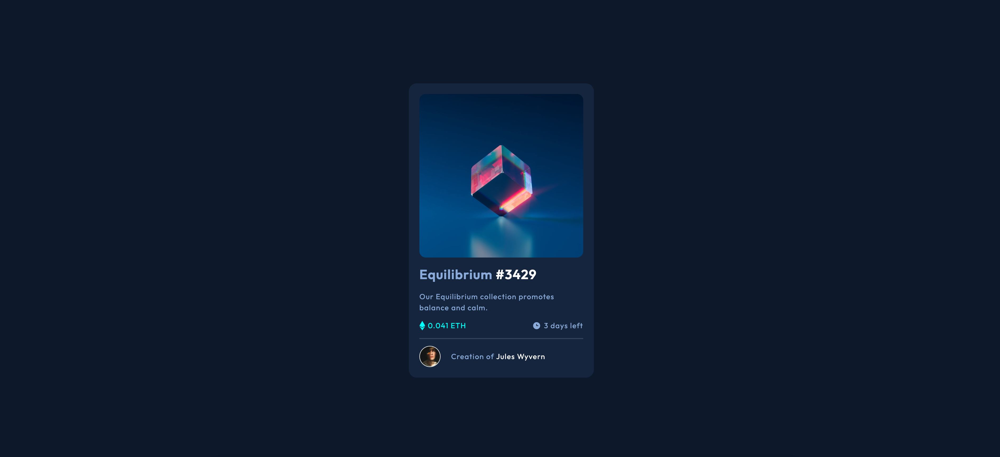

# Frontend Mentor - NFT preview card component solution

This is a solution to the [NFT preview card component challenge on Frontend Mentor](https://www.frontendmentor.io/challenges/nft-preview-card-component-SbdUL_w0U). Frontend Mentor challenges help you improve your coding skills by building realistic projects. 

### Screenshot

### Links

- [Solution URL:](https://github.com/ToprakOzgur/frontendmento.io-challenges/tree/main/nft-preview-card-component)
- [Live Site URL:](https://awesome-carson-4c9fc6.netlify.app/)

### Built with

- Semantic HTML5 markup
- CSS custom properties
- Flexbox
- CSS Grid
- Mobile-first workflow
