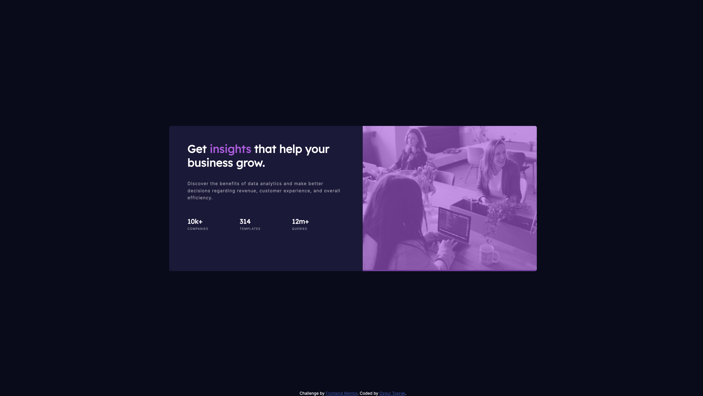

# Frontend Mentor - NFT preview card component solution

This is a solution to the [Stats preview card component challenge on Frontend Mentort](https://www.frontendmentor.io/challenges/stats-preview-card-component-8JqbgoU62). Frontend Mentor challenges help you improve your coding skills by building realistic projects. 

### Screenshot

### Links

- [Solution URL:](https://github.com/ToprakOzgur/frontendmento.io-challenges/tree/main/stats-preview-card-component)
- [Live Site URL:](https://gallant-volhard-2db3f5.netlify.app/)

### Built with

- Semantic HTML5 markup
- CSS custom properties
- Flexbox
